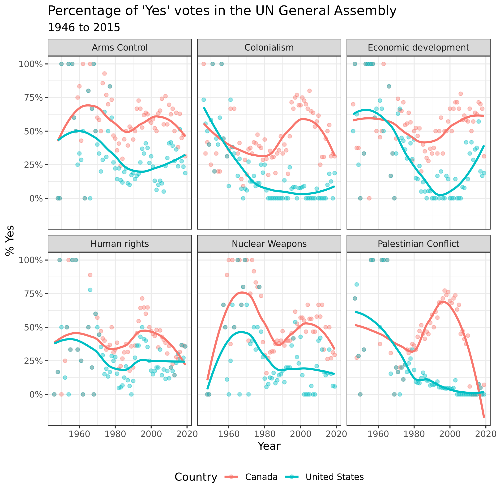

```{r setup, include=FALSE}
knitr::opts_chunk$set(echo = TRUE, comment = "")
library(tidyverse)
library(lubridate) #should already be installed as a part of the tidyverse, we will talk more about this in Week 10
library(scales)  #you may need to install package `scales`
```


## Data Description
The data this week comes from Harvard's Dataverse by way of Mine Çetinkaya-Rundel, David Robinson, and Nicholas Goguen-Compagnoni.

>Original Data citation: Erik Voeten "Data and Analyses of Voting in the UN General Assembly" Routledge Handbook of International Organization, edited by Bob Reinalda (published May 27, 2013). Available at SSRN: http://ssrn.com/abstract=2111149

It was recently featured on [TidyTuesday](https://github.com/rfordatascience/tidytuesday/blob/master/data/2021/2021-03-23/readme.md)

Here is each data set and its description (you might want to look at the Tidy Tuesday link for the tables already rendered)

`unvotes.csv`

|variable     |class     |description |
|:------------|:---------|:-----------|
|rcid         |double    | The roll call id; used to join with un_votes and un_roll_call_issues |
|country      |character | Country name, by official English short name |
|country_code |character | 2-character ISO country code |
|vote         |integer   | Vote result as a factor of yes/abstain/no |

```{r}
unvotes <- read_csv("data/unvotes.csv")
```


`roll_calls.csv`

|variable      |class     |description |
|:-------------|:---------|:-----------|
|rcid          |integer   |.           |
|session       |double    | Session number. The UN holds one session per year; these started in 1946|
|importantvote |integer   | Whether the vote was classified as important by the U.S. State Department report "Voting Practices in the United Nations". These classifications began with session 39|
|date          |double    | Date of the vote, as a Date vector|
|unres         |character | Resolution code |
|amend         |integer   | Whether the vote was on an amendment; coded only until 1985 |
|para          |integer   | Whether the vote was only on a paragraph and not a resolution; coded only until 1985|
|short         |character |  Short description |
|descr         |character | Longer description|


```{r}
roll_calls <- read_csv("data/roll_calls.csv")
```


`issues.csv`

|variable   |class     |description |
|:----------|:---------|:-----------|
|rcid       |integer   | The roll call id; used to join with unvotes and un_roll_calls |
|short_name |character | Two-letter issue codes |
|issue      |integer   | Descriptive issue name |

```{r}
issues <- read_csv("data/issues.csv")
```


## Data Exploration
Our goal today is to explore how various members (countries) in the United Nations vote. We have three data sets, what can we determine from each data set separately?


### UN Votes

The first data set, `unvotes` contains data on the `rcid` which is the roll call id for the vote, the country/country code, and how the country voted. What can we learn from the data?  


Comment on the following code, what is happening in each line?

```{r}
unvotes %>% 
  count(country, vote) %>% #counts the country and vote variables 
  group_by(country) %>% #with group the values by country 
  mutate(total = sum(n)) %>% #adds a new variable called total  
  mutate(prop_vote = n/total) %>% #adds a new variable 
  filter(country %in% c("United States", "Canada", 
                        "Germany", "France",
                        "Italy", "Japan",
                        "United Kingdom")) %>% #cleans the data to only show the states you want to have. .
  ggplot(aes(x = country, y = prop_vote, 
             fill = vote)) + #this will create a plot based on what coutry and prop_vote
  geom_col(position = position_stack()) + #this specifies what type of graph you want in this case a column one
  labs(x = "Group of Seven Countries",
       y = "Proportion of Votes",
       title = "Voting Record of the G7",
       fill = "Vote") + #this does the break down the label names
  theme_minimal() +  #this will change the background to have no annotations. 
  scale_fill_viridis_d(end = 0.8) + #makes the color scheme cohesive
  coord_flip() #this flips the ordinates fo that the horizontal becomes the vertical and vice versa. 
```

> Describe what the graph above demonstrates above UN voting records for the G7 

### Roll Calls

The second data set, `roll_calls` has more information on the type of vote, the importance, whether it was a resolution, and date of the vote.  What does eh following code do?

```{r}
roll_calls %>% 
  distinct(short)
```
> Shows the uniqur rows with in the short variable. 


We can use the individual data for `roll_calls` to look at the number of votes per year over time.
```{r}
roll_calls %>% 
  mutate(year = lubridate::year(date)) %>% #extracts the year from the date value and creates a new `year` column
  count(year) %>% #counts how many votes there were per year assuming each line is an single voting instance
  ggplot(aes(x = year, y = n)) +
  geom_line() +
  labs(x = "Year", y = "Number of Votes",
       title = "UN Votes per Year") +
  theme_minimal()
```

What information is missing from the above graphic that might be useful in understanding the issues the UN commonly votes on?

> If you were to add in differnt graphics that can it break it down into what categories the votes fall under. 


We could try and look at the short descriptions, `short`, for each vote with the following code. 
```{r}
roll_calls %>% 
  count(short)
```

Does the above information help us understand the voting issues of the UN over time? Explain.

> Not realling seeing as this also includes time land marks that arent votes on such as when a country having an annaversary of a big event. 


### Issues 
Finally we have the `issues` data which provides a more general description for each vote on specific issues.  Note that not all issues are included in the data set, just the ones related to the 6 issues below:

```{r}
issues %>% 
  count(issue)
```

It would be helpful to use the `issues` data with the `roll_calls` data to be able to better understand the voting trends within the UN on at least these 6 issues. To do this, we need to join the data.  


## Joining Data  

First, look at the number of rows in `issues` and `roll_calls` - do they match? What does this indicate?

```{r}
View(issues)
View(roll_calls)
dim(issues)
dim(roll_calls)
```


> they dont match wich means that they are either named differnt in one section than the other or it can mean that there is more varibales in one data set than the other


Now let's try joining the `roll_calls` with the `issues` data.  Compare the following codes to join the data. Describe what each one does and how it differs from the others as a comment in the code chunk.  You might need to reference the slides or reading for this week.

```{r}
roll_calls %>% 
  left_join(issues, by = "rcid") #will includes all rows but adds in 
```

```{r}
roll_calls %>% 
  right_join(issues, by = "rcid") #description of join
```

```{r}
roll_calls %>% 
  full_join(issues, by = "rcid") #description of join
```

```{r}
roll_calls %>% 
  inner_join(issues, by = "rcid") #description of join
```

If we are only interested in retaining the records associated with the `issues` labeled in our data, which join(s) should we use?

> Right joing would be the best option in this case because it will filter out the data and keep all the issues ones but get loos those ones in the roll_call that dont have one associated. 


Now that we know how to join the data, we will use the following code to examine the the voting trends for three of the issues related to conflict/weapons. 

Be sure to run the code via the green arrow on the code chunk, as the `case_when()` code can get finicky sometimes and claim an error about a comma in the code when it doesn't exist.  *Comment on the code where indicated* and add your chosen join function
```{r}
roll_calls %>% 
  right_join(issues, by = "rcid") %>%  #join roll_calls and issues so that just the votes related to the issues data are retained.
  mutate(issue = case_when(
    issue == "Arms control and disarmament" ~ "Arms Control",
    issue == "Nuclear weapons and nuclear material" ~ "Nuclear Weapons",
    issue == "Palestinian conflict" ~ "Palestinian Conflict")) %>%   #classiftying which of the cases will be known as issue, and waht to label them 
  drop_na(issue) %>% #drop NAs for values not defined in the previous line of code
  mutate(year = lubridate::year(date)) %>% #create a column `year` that contains the year value
  count(year, issue) %>% #Counting the unique veritable in the data set
  ggplot(aes(x = year, y = n, group = issue)) + #formulating a graphic and telling r what the x and y values
  geom_line(aes(color = issue)) + #this is making a line graphics and setting the aesthetic of the graph
  labs(x = "Year", y = "Number of Votes",
       title = "United Nations Votes per Year",
       subtitle = "Conflict and Arms Related Votes",
       color = "Voting Issue") +
  theme_minimal()
```


What do you notice? What do you wonder based on the graph created?
> I noticed that that graphic is a bit confusing to read because of the colorations. we noticed that they have a very similar trend to one another, i wonder if the conflict with in teh palestinains is causing votinging trentsd for weapsons is the reason. 


## Joining all Data
We want to try and create the following visualization


To do this, though, we need information from all three data set, `unvotes`, `issues`, and `roll_calls`

We want to join all three data sets together, *maintaining only the votes for which we have identified the general issue* (e.g., Nuclear War, Arms, Economics, etc.).  We will save (assign) the data as `un_full`.  Fill in the best *join functions* to do maintain just the votes for which we have identified the general issue.

```{r}
un_full <- unvotes %>% 
  right_join(issues, by = "rcid") %>% 
  left_join(roll_calls, by = "rcid") 

#View(un_full)
```


Now, we are going to do some data cleaning.  Our goal is create a data set that includes the percentage of "yes" votes per country each year. Fill in the missing _________ with the correct verbs. We will call the data table `yes_votes`
```{r}
yes_votes <- un_full %>% 
  select(country, issue, date, vote) %>%  #keep just the columns for country, issue, date, vote
  mutate(year = lubridate::year(date)) %>% #create a new variable called year
  group_by(country, year, issue) %>% #group country, year, issue together to prepare for subsequent analysis
  summarise(percent_yes = mean(vote == "yes")) %>% #calculate the proportion of yes votes
  mutate(issue = case_when(
    issue == "Arms control and disarmament" ~ "Arms Control",
    issue == "Nuclear weapons and nuclear material" ~ "Nuclear Weapons",
    issue == "Palestinian conflict" ~ "Palestinian Conflict",
    TRUE ~ issue)) #create/overwrite issue column with simpler values


View(yes_votes) #you can use this code to look at the table created
```


Now we can feed the `yes_votes` transformed data table into your graphing code, but first we will want to focus on the United States and Canada. *Provide a comment to describe what each line of code is doing in the process*.
```{r}
yes_votes %>% 
  filter(country %in% c("United States","Canada")) %>% # grabs those who values  contain United States,  Canada 
  ggplot(mapping = aes(x = year, y = percent_yes, color = country)) + # this makes an graphic where we will be plotting year and percent of the yes's
  geom_point(alpha = 0.4) + #making the graphic into a point graph
  #geom_line(aes(group = country)) +
  geom_smooth(method = "loess", se = FALSE) + #this fits a special model called a loss regression, a smooth line that fits the data
  facet_wrap(~issue) + # this is  our way of seeing the graphics show up side by side
  scale_y_continuous(labels = scales::percent) +
  labs(
    title = "Percentage of 'Yes' votes in the UN General Assembly",
    subtitle = "1946 to 2015",
    y = "% Yes",
    x = "Year",
    color = "Country"
  ) +
  theme_bw() +
  theme(legend.position = "bottom") 
```


## Adding more data
After your instructor created the above plot, she became curious about how politics might impact the UN Voting record for the United States since UN Ambassador is a presidential appointment. So your instructor started searching for a data set of US presidents, their years in office, and their political affiliation.  She found a data set on Kaggle.com and removed the information prior to 1940 (because the dates were coded funny and it was causing problems). She saved the data as `us_presidents.csv` and imported it into the project.

```{r}
president <- read_csv("data/us_presidents.csv")
```

She realized that her data only had the start/end dates for each president and she wanted a data set that filled in the missing years and political party for the president in that time period.  After much googling and reading Stack Overflow, found two functions she did not know about called `complete()` and `fill()` to fill in the missing years and party affiliations
```{r}
politics_year <- president %>% 
    mutate(start = lubridate::mdy(start),  #formats date correctly
           start_year = lubridate::year(start)) %>% #pulls out year
  filter(start_year > 1940) %>%  #removes data before 1940 since there was no UN
  select(start_year, party) %>%   #pulls out just the variables of interest
  complete(start_year = seq(min(start_year), 2020, by=1)) %>% #fill in missing years
  fill(party) #fill in missing party affiliations for years
```


Next, your instructor took the `yes_votes` data and filtered out just the United States data and then joined by year to add the party affiliation of the president for each year of UN votes.  To create the visualization with the smoothed model, but color by party affiliation, she had to add a new column called `predict` that fit the model first instead of using `geom_smooth()`.
```{r}
yes_votes %>% 
  filter(country == "United States") %>% 
  left_join(politics_year, by = c("year" = "start_year")) %>% 
  group_by(issue) %>% 
  mutate(predict = predict(loess(percent_yes~year))) %>% 
  ggplot(mapping = aes(x = year, color = party, group = 1)) +
  geom_point(aes(y = percent_yes),alpha = 0.4) +
  geom_line(aes(y = predict)) +
  facet_wrap(~issue) +
  scale_y_continuous(labels = scales::percent) +
  labs(
    title = "Percentage of 'Yes' votes in the UN General Assembly",
    subtitle = "1946 to 2015",
    y = "% Yes",
    x = "Year",
    color = "Country"
  ) +
  theme_bw() +
  scale_color_manual(values = c("blue", "red")) +
  theme(legend.position = "bottom") 
```

What do you notice? What do you wonder?

> To me it is pretty iteresting to a downward trend in yes votew un the 2000 for the most part i wa woderin what was going on and wonderin if it had anythinto do wiht 9/11. 

## YOUR TURN
Using the UN Votes data, explore a research question on your own using the provided data.  You can modify one of the graphs created above or bring a new data set to join with existing data to explore another question.  Provide a data visualization and explanation of your observations.

```{r}
yes_votes %>% 
  filter(issue %in% c("Human rights","Nuclear Weapons")) %>% 
  filter(country == "United States")
  ggplot(aes(x = year, y = percent_yes)) + 
  geom_point(alpha = 0.4) + #making the graphic into a point graph
  #geom_line(aes(group = country)) +
  geom_smooth(method = "loess", se = FALSE) + #this fits a special model called a loss regression, a smooth line that fits the data
  facet_wrap(~issue) + # this is  our way of seeing the graphics show up side by side
  scale_y_continuous(labels = scales::percent) +
  labs(
    title = "Percentage of 'Yes' votes in the UN General Assembly",
    subtitle = "1946 to 2015",
    y = "% Yes",
    x = "Year",
    color = "issue"
  ) +
  theme_bw() +
  theme(legend.position = "bottom") 
```

> i was attemting to try to get all the countries to show their graphis and then i realized it was going to be alot of graphs made. but this one is pretty cool to see that there use to be mre votes on Nuclear Weapons but theres a slow decrease in yes votes to NW and higher numbers in Human rights yes votes.

